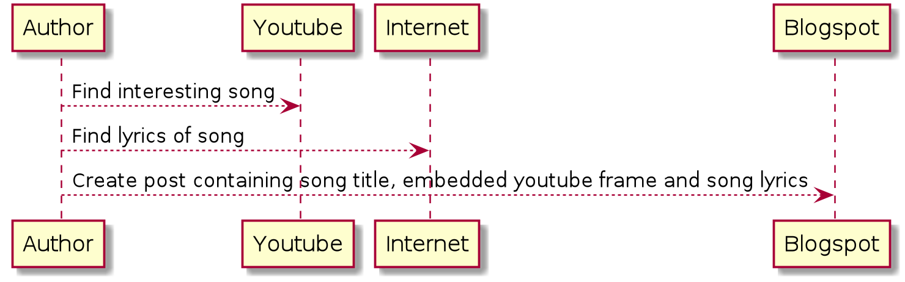
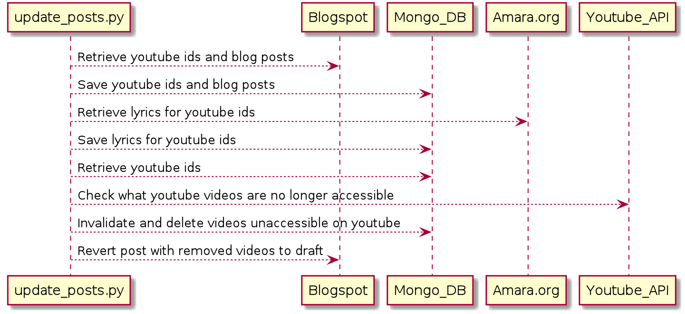
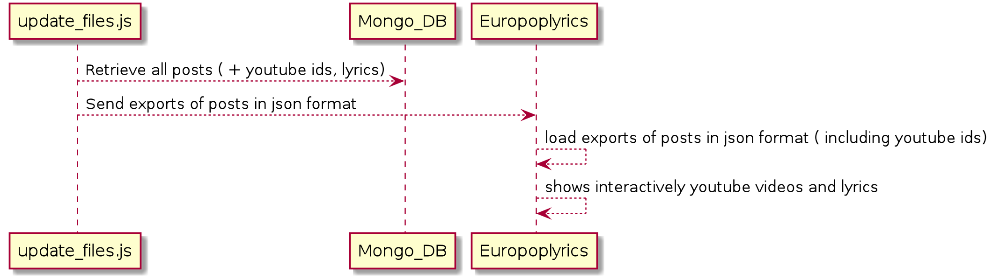

## EURO POP LYRICS

Front end for the web site http://www.europoplyrics.com

### REPOSITORY 

Frontend : https://github.com/diegoami/JS_FE_musicblogs

Backend : https://github.com/diegoami/JS_musicblogs

Database scripts : https://github.com/diegoami/musicblogs-scripts-PY

### REFERENCE MUSIC BLOGS

- http://russianlyrics.blogspot.com/
- http://polishlyrics.blogspot.com/
- http://romanianlyrics.blogspot.com/
- http://southslaviclyrics.blogspot.com/
- http://easterneuropelyrics.blogspot.com/
- http://frenchmusiclyrics.blogspot.com/
- http://italianlyrics.blogspot.com/

### ARCHITECTURE

The data is in a few blogs, which contain references to youtube music videos along with their lyrics. They are entered by the author (me)

Database scripts retrieve data from the blogs and save them in a mongo database. 
They also check against the Youtube API whether videos are still accessible, and write down a report

An export of all the posts, including youtube video ids and lyrics, is used by Europoplyrics site for browsing youtube videos, and, if available, showing them along with their lyrics.

